# WEB_LAB-2

<p align = "center">МИНИСТЕРСТВО НАУКИ И ВЫСШЕГО ОБРАЗОВАНИЯ<br>
РОССИЙСКОЙ ФЕДЕРАЦИИ<br>
ФЕДЕРАЛЬНОЕ ГОСУДАРСТВЕННОЕ БЮДЖЕТНОЕ<br>
ОБРАЗОВАТЕЛЬНОЕ УЧРЕЖДЕНИЕ ВЫСШЕГО ОБРАЗОВАНИЯ<br>
«САХАЛИНСКИЙ ГОСУДАРСТВЕННЫЙ УНИВЕРСИТЕТ»</p>
<br><br><br><br><br><br>
<p align = "center">Институт естественных наук и техносферной безопасности<br>Кафедра информатики<br>Шинкаренко Кирилл Константинович</p>
<br><br><br>
<p align = "center"><br><strong>Лабораторная работа №2.</strong><br>01.03.02 Прикладная математика и информатика</p>
<br><br><br><br><br><br><br><br><br><br><br><br>
<p align = "right">Научный руководитель<br>
Соболев Евгений Игоревич</p>
<br><br><br>
<p align = "center">г. Южно-Сахалинск<br>2024 г.</p>
<br><br><br><br><br><br><br><br><br><br><br><br>

<h1 align = "center">Введение</h1>
<p><b>HTML</b> —  стандартизированный язык гипертекстовой разметки документов для просмотра веб-страниц в браузере. Веб-браузеры получают HTML документ от сервера по протоколам HTTP/HTTPS или открывают с локального диска, далее интерпретируют код в интерфейс, который будет отображаться на экране монитора.</p>
<p><b>CSS</b> — формальный язык описания внешнего вида документа, написанного с использованием языка разметки. Также может применяться к любым XML-документам, например, к SVG или XUL.</p>
<p><b>JavaScript</b> — мультипарадигменный язык программирования. Поддерживает объектно-ориентированный, императивный и функциональный стили. Является реализацией спецификации ECMAScript. JavaScript обычно используется как встраиваемый язык для программного доступа к объектам приложений..</p>

<br>
<h1 align = "center">Цели и задачи</h1>

<ol>
  <li>Повторите страницу по данному по образцу</li>
  <li>Повторите страницу по данному по образцу</li>
  <li>Повторите страницу по данному по образцу</li>
  <li>Повторите страницу по данному по образцу</li>
  <li>Повторите страницу по данному по образцу</li>
  <li>Повторите страницу по данному по образцу</li>
  <li>Создать структуру HTML страницы с использованием заголовка, абзацев, списков и изображений.</li>
  <li>Вставить видео на страницу с помощью тега &lt;video&gt; и добавить управляющие элементы.</li>
  <li>Создать форму обратной связи с полями для ввода имени, email и сообщения.</li>
  <li>Разработать таблицу с данными о товарах (название, цена, описание) и стилизовать её с помощью CSS.</li>
  <li>Добавить на страницу интерактивную карту с маркерами и информацией о местоположении.</li>
  <li>Реализовать выпадающее меню навигации с использованием HTML и CSS.</li>
  <li>Вставить аудио-плеер на страницу для воспроизведения музыкального трека.</li>
  <li>Создать галерею изображений с возможностью пролистывания и увеличения фотографий.</li>
  <li>Разработать форму заказа товара с выбором количества и кнопкой отправки заказа.</li>
  <li>Использовать iframe для встраивания внешнего контента (например, карты Google или видео с YouTube).</li>
  <li>Добавить на страницу анимированный слайдер с переходами между изображениями.</li>
  <li>Реализовать функционал проверки вводимых данных в форме с помощью JavaScript.</li>
  <li>Создать анимированное меню бургер для мобильной версии сайта.</li>
  <li>Использовать тег &lt;canvas&gt; для создания простой графики или анимации на странице.</li>
  <li>Добавить на страницу элементы социальных сетей с возможностью перехода по ссылкам.</li>
  <li>Разработать форму регистрации пользователей с проверкой пароля на соответствие требованиям.</li>
  <li>Создать табличное представление данных с возможностью сортировки и фильтрации по столбцам.</li>
  <li>Использовать Web-шрифты для стилизации текста на странице.</li>
  <li>Реализовать функционал Drag and Drop для перетаскивания элементов на странице.</li>
  <li>Создать адаптивную веб-страницу, которая корректно отображается на разных устройствах и разрешениях экрана.</li>
</ol>

<h1 align="center">Решение</h1>
<h2 align="center">Файл index.html</h2>

```
<!DOCTYPE html>

<html lang="ru">

<head>

    <meta charset="UTF-8">

    <meta name="viewport" content="width=device-width, initial-scale=1.0">

    <title>mainPage</title>

    <style>

        html {

            width: 100%;

            height: 100%;

        }

        body {

            font-family: sans-serif;

            background: linear-gradient(146deg, rgba(2,0,36,1) 0%, rgba(9,9,121,1) 15%, rgba(0,212,255,1) 100%);

            background-repeat: no-repeat;

            background-size: 100% 100%;

            width: 100%;

            padding: 0;

            margin: 0;

            display: inline-block;

            color: white;

        }

  

        .content {

            display: flex;

        }

  

        .category {

            margin-right: auto;

            margin-left: auto;

        }

  

        ul {

            list-style: disc;

            padding: 0;

            margin: 0;

        }

  

        a {

            text-decoration: none;

            font-size: 32px;

            color: white;

        }

  

        li {

            padding-top: 20px;

            font-size: 32px;

        }

  

        h1 {

            text-align: center;

            font-size: 54px;

        }

    </style>

</head>

<body>

    <div class="heading">

        <h1>Выберите задание:</h1>

    </div>

  

    <div class="content">

        <div class="category">

            <ul>

                <li><a href="./headersLN.html">Задание с заголовками</a></li>

                <li><a href="./cms.html">О CMS</a></li>

                <li><a href="./lists.html">Списки</a></li>

                <li><a href="./webStack.html">Стэк для Web-разработки</a></li>

                <li><a href="./mops.html">Мопс</a></li>

            </ul>

        </div>

    </div>

</body>

</html>
```


<h2 align="center">Файл lists.html</h2>

```
<!DOCTYPE html>

<html lang="en">

<head>

    <meta charset="UTF-8">

    <meta name="viewport" content="width=device-width, initial-scale=1.0">

    <title>Document</title>

    <style>

        h2, h4 {

            font-family: "Calibri Light";

            font-weight: 100;

        }

  

        h4 {

            font-size: 13;

        }

  

        h2 {

            margin-bottom: -20px;

            padding: 0;

            font-size: 16;

        }

        ul, ol {

            font-family: 'Times New Roman';

            font-size: 13.5;

        }

    </style>

</head>

<body>

    <h2>Списки</h2>

    <h4>Списки цветов</h4>

    <ul>

        <li>Красный</li>

        <li>Желтый</li>

        <li>Зелёный</li>

        <li>Синий</li>

    </ul>

    <h4>Список студентов</h4>

    <ol>

        <li>Иванов</li>

        <li>Петров</li>

        <li>Сидоров</li>

        <li>Николаев</li>

    </ol>

    <h4>Список студентов</h4>

    <ol>

        <li>Иванов

            <ul>

                <li>Возраст - 23 года</li>

                <li>Курс - 3</li>

            </ul>

        </li>

        <li>Петров

            <ul>

                <li>Возраст - 19 лет</li>

                <li>Курс - 2</li>

            </ul>

        </li>

        <li>Сидоров

            <ul>

                <li>Возраст - 18 лет</li>

                <li>Курс - 1</li>

            </ul>

        </li>

    </ol>

</body>

</html>
```

<h2 align="center">Файл mops.html</h2>

```
<!DOCTYPE html>

<html lang="ru">

<head>

    <meta charset="UTF-8">

    <meta name="viewport" content="width=device-width, initial-scale=1.0">

    <title>Document</title>

    <style>

        img {

            width: 100%;

            height: 100%;

        }

  

        body {

            padding: 0;

            margin: 0;

            background-image: url(../img1.jpg);

        }

    </style>

</head>

<body>

    

</body>

</html>
```

<h2 align="center">Файл headersLN.html</h2>

```
<!DOCTYPE html>

<html lang="ru">

<head>

    <meta charset="UTF-8">

    <meta name="viewport" content="width=device-width, initial-scale=1.0">

    <title>Document</title>

    <style>

        h1, h2, h4, #special {

            font-weight: lighter;

            font-family: "calibri light";

            font-style: normal;

        }

  

        h4 {

            margin-top: -15px;

            padding: 0;

            font-size: 13;

        }

  

        h3, p {

            font-family: 'Times New Roman';

        }

  

        #special, h1 {

            font-style: italic;

        }

        h1 {

            font-size: larger;

        }

  

        h2, h1 {

            font-size: 16;

        }

  

        h3, #special, p {

            font-size: 13.5;

        }

    </style>

</head>

<body>

    <h2>Это заголовок</h2>

    <h4>Это заголовок</h4>

    <h3>Это заголовок</h3>

    <h3 id="special">Это заголовок</h3>

    <p>Это <strong>абзац</strong></p>

    <p>Это ещё <i>абзац</i></p>

    <h1>Это заголовок h1</h1>

</body>

</html>
```

<h2 align="center">Файл cms.html</h2>

```
<!DOCTYPE html>

<html lang="ru">

<head>

    <meta charset="UTF-8">

    <meta name="viewport" content="width=device-width, initial-scale=1.0">

    <title>Document</title>

    <style>

        h3, h5 {

            font-family: "Calibri Light";

            font-weight: 100;

        }

  

        h5 {

            font-size: 13;

        }

  

        h3 {

            font-size: 16;

        }

  

        p {

            font-size: 13.5;

            font-family: 'Times New Roman';

        }

    </style>

</head>

<body>

    <h3>Что такое CMS</h3>

    <p><b>CMS</b> - «система управления контентом» (<b>движок</b>) – написанная PHP-программистами основа для сайта, с помощью которой вы сможете управлять сайтом (добавлять контент, менять пункты меню и т.п.) не зная HTML и CSS.</p>

    <p>Однако, для того чтобы сделать сайт с помощью <b>CMS</b> <i>потребуются услуги</i> и программиста, и дизайнера, и верстальщика. И капиталовложения.</p>

    <h5>Какие бывают cms</h5>

    <p>Бывают различные системы управления контентом: для интернет-магазинов, для блогов, для форумов и т.д.</p>

    <h5>Примеры cms</h5>

    <p><i>Примеры популярных</i> CMS: Joomla, WordPress (для блогов), PhpBB (для форумов).</p>

    <p><b>CMS-ки</b> бывают <i>платные</i> и <i>бесплатные.</i></p>

</body>

</html>
```

<h2 align="center">Файл webStack.html</h2>

```
<!DOCTYPE html>

<html lang="ru">

<head>

    <meta charset="UTF-8">

    <meta name="viewport" content="width=device-width, initial-scale=1.0">

    <title>Document</title>

    <style>

        h1, h4 {

            font-family: "Calibri Light";

            font-weight: 100;

        }

  

        h1 {

            font-size: 18;

        }

  

        ol, p {

            font-family: 'Times New Roman';

        }

  

        h4 {

            font-size: 13;

        }

    </style>

</head>

<body>

    <h1>Что нужно знать, чтобы делать сайты</h1>

    <ol>

        <li><b>HTML</b></li>

        <li><i>CSS</i></li>

        <li>PHP</li>

        <li>SQL</li>

        <li>JavaScript</li>

        <li>jQuery</li>

        <li>Flash</li>

        <li>SEO</li>

    </ol>

  

    <h4>PHP и JavaScript</h4>

  

    <p>Языки программирования <b>PHP</b> и <b>JavaScript</b> позволяют сделать сайт динамичным, то есть реагирующим на действия пользователя. Например, можно сделать красивую выпадающую менюшку или слайдер</p>

  

    <h4>Виды скриптов</h4>

  

    <p>Для этого пишутся скрипты (англ. <i>script</i> - «сценарий») - программы, позволяющиее реагировать на действия пользователя. Скрипты бывают двух видов:</p>

  

    <ul>

        <li>те, которые выполняются на сервере, а результат их выполнения приходит в браузер к пользователю уже в готовом виде. Это скрипты, написанные на языке <b>PHP</b>. На нем пишуться <b>CMS-ки</b> – системы управления контентом.</li>

        <li>те, которые выполняются прямо в браузере пользователя. Это скрипты, написанные на языке <b>JavaScript</b>. Они чаще всего используются для, того чтобы сделать страницу более удобной и красивой.</li>

    </ul>

  

</body>

</html>
```

<h2 align="center">Файл 7.html</h2>

```
<!DOCTYPE html>

<html lang="en">

<head>

    <meta charset="UTF-8">

    <meta name="viewport" content="width=device-width, initial-scale=1.0">

    <link rel="stylesheet" href="../styles/7.css">

    <title>Document</title>

</head>

<body>

    <header>

        <nav>

            <div class="nav-links">

                <a href="">Home</a>

                <a href="">About</a>

                <a href="">Contacts</a>

            </div>

            <div class="nav-icon">

                

            </div>

        </nav>

    </header>

    <div class="content">

        <h1>Мопсы</h1>

        <div class="content-part">

            <h2>Что вы знаете о Мопсах?</h2>

            <p>Мопсы относятся к декоративным породам и принадлежат к группе собак-компаньонов. Собаки с уравновешенным и спокойным характером подходят для жизни в городе, преданы хозяину и хорошо уживаются с детьми. Мопсы не требуют особого ухода, поэтому их рекомендуется заводит владельцам без опыта содержания собак.</p>

        </div>

  

        <div class="content-part">

            <h2>Виды Мопсов:</h2>

            <ul>

                <li><strong>Терьерный тип</strong> — самый привлекательный тип с немного удлиненной шеей и прямым торсом.</li>

                <li><strong>Бульдожий тип</strong> отличается широким торсом и косо поставленными, но мускулистыми лапами.</li>

                <li><strong>Шарпейный тип</strong> с многочисленными складками, которые скрывают недостатки породы.</li>

            </ul>

        </div>

  

        <div class="content-part">

            <h2>Забавные фотографии:</h2>

            <div class="photos">

                

                

                

            </div>

        </div>

  

    </div>

</body>

</html>
```

<h2 align="center">Файл 8.html</h2>

```
<!DOCTYPE html>

<html lang="en">

<head>

    <meta charset="UTF-8">

    <meta name="viewport" content="width=device-width, initial-scale=1.0">

    <title>Document</title>

    <style>

        video {

            width: 800;

            height: 600;

        }

    </style>

</head>

<body>

    <video src="../Rick_Astley_-_Never_Gonna_Give_You_Up_(1987_g.)-world69.spcs.bio.mp4" controls></video>

</body>

</html>
```

<h2 align="center">Файл 9.html</h2>

```
<!DOCTYPE html>

<html lang="en">

<head>

    <meta charset="UTF-8">

    <meta name="viewport" content="width=device-width, initial-scale=1.0">

    <link rel="stylesheet" href="/styles/9.css">

    <title>Document</title>

</head>

<body>

    <form>

        <div class="form-content first-line">

            <div class="name">

                <label for="name">Имя:</label>

                <input type="text" required>

            </div>

            <div class="email">

                <label for="email">Email:</label>

                <input type="email" required>

            </div>

        </div>

  

        <div class="form-content mess">

            <label for="message">Сообщение:</label>

            <textarea required></textarea>

        </div>

        <div class="form-content btn">

            <button type="submit">Отправить</button>

        </div>

    </form>

</body>

</html>
```

<h2 align="center">Файл 10.html</h2>

```
<!DOCTYPE html>

<html lang="en">

<head>

    <meta charset="UTF-8">

    <meta name="viewport" content="width=device-width, initial-scale=1.0">

    <title>Document</title>

    <link rel="stylesheet" href="../styles/10.css">

</head>

<body>

    <table>

        <tr>

            <th>ID</th><th>Товар</th><th>Цена</th><th>Описание</th>

        </tr>

        <tr>

            <td>1</td><td>Яблоки</td><td>250</td><td>Фуджи</td>

        </tr>

        <tr>

            <td>2</td><td>Помидоры</td><td>310</td><td>Большие, красные</td>

        </tr>

        <tr>

            <td>3</td><td>Груши</td><td>240</td><td>Японские</td>

        </tr>

    </table>

</body>

</html>
```

<h2 align="center">Файл 11.html</h2>

```
<!DOCTYPE html>

<html lang="en">

<head>

    <meta charset="UTF-8">

    <meta name="viewport" content="width=device-width, initial-scale=1.0">

    <title>Document</title>

  

    <script src="https://api-maps.yandex.ru/2.1/?apikey=1cea049b-f899-4835-b1fe-051a35c5d8ce&lang=ru_RU"

    type="text/javascript">

    </script>

    <script type="text/javascript">

        ymaps.ready(function(){

            var moscow_map = new ymaps.Map("first_map", {

                center: [46.957469, 142.725785],

                zoom: 7

            });

        });

    </script>

</head>

<body>

    <p>Карта Южно-Сахалинска</p>

    <div id="first_map" style="width:400px; height:300px"></div>

</body>

</html>
```

<h2 align="center">Файл 12.html</h2>

```
<!DOCTYPE html>

<html lang="en">

<head>

    <meta charset="UTF-8">

    <meta name="viewport" content="width=device-width, initial-scale=1.0">

    <title>Document</title>

    <link rel="stylesheet" href="../styles/12.css">

</head>

<body>

    <div class="nav">

        <div class="nav_heads">

            <div>

                <a href="">Главная</a>

            </div>

  

            <div class="dropDown">

                <a href="" class="dropMenu">Меню</a>  

                <div class="dropList">

                    <a href="">1</a>

                    <a href="">2</a>

                    <a href="">3</a>

                </div>

            </div>

             <div>

                <a href="">Контакты</a>

             </div>

  

             <div>

                <a href="">О нас</a>

             </div>

        </div>

    </div>

</body>

</html>
```

<h2 align="center">Файл 13.html</h2>

```
<!DOCTYPE html>

<html lang="en">

<head>

    <meta charset="UTF-8">

    <meta name="viewport" content="width=device-width, initial-scale=1.0">

    <title>Document</title>

</head>

<body>

    <audio controls src="../Rick_Astley_-_Never_Gonna_Give_You_Up_(1987_g.)-world69.spcs.bio.mp4"></audio>

</body>

</html>
```

<h2 align="center">Файл 14.html</h2>

```
<!DOCTYPE html>

<html lang="en">

<head>

    <meta charset="UTF-8">

    <meta name="viewport" content="width=device-width, initial-scale=1.0">

    <link rel="stylesheet" href="/styles/14.css">

  

    <title>Document</title>

</head>

<body>

    <div class="black">

        <div id="darker"onclick="hideBlack()"></div>

        <div class="scoped">

            

            

            

            

        </div>

    </div>

    <div class="container">

        <div class="slides">

            <div class="mySlides">

                

            </div>

            <div class="mySlides">

                

            </div>

            <div class="mySlides">

                

            </div>

            <div class="mySlides">

                

            </div>

        </div>

  

        <div class="next-prev">

            <a class="prev" onclick="plusSlides(-1)">&#10094;</a>

            <a class="next" onclick="plusSlides(1)">&#10095;</a>

        </div>

  

        <div class="btn-scope">

            <button onclick="scope()">Увеличить +</button>

        </div>

  

        <div class="row">

            <div class="column">

                

            </div>

            <div class="column">

                

            </div>

            <div class="column">

                

            </div>

            <div class="column">

                

            </div>

        </div>

  

    </div>

  
  

    <script src="/scripts/14.js"></script>

</body>

</html>
```

<h2 align="center">Файл 15.html</h2>

```
<!DOCTYPE html>

<html lang="en">

<head>

    <meta charset="UTF-8">

    <meta name="viewport" content="width=device-width, initial-scale=1.0">

    <link rel="stylesheet" href="/styles/15.css">

    <title>Document</title>

</head>

<body>

    <form action="">

        <div class="order-box">

            <div class="order-heading">

                <h2>Заказ №0000</h2>

            </div>

            <div class="order-view">

                <div class="order-icon">

                    

                </div>

                <div class="order-name">

                    <p>*Название товара*</p>

                </div>

            </div>

            <div class="order-fields">

                <div class="count">

                    <label for="number">Выберите кол-во товаров:</label>

                    <input type="number" min="1" max="10" placeholder="1" required>

                </div>

                <div class="address">

                    <label for="address">Укажите адрес:</label>

                    <input type="text" placeholder="ул.Пушкина, д.35" required>

                </div>

            </div>

  

            <div class="button">

                <button id="btn-sub" type="submit">Отправить</button>

            </div>

        </div>

  

    </form>

</body>

</html>
```

<h2 align="center">Файл 16.html</h2>

```
<!DOCTYPE html>

<html lang="en">

<head>

    <meta charset="UTF-8">

    <meta name="viewport" content="width=device-width, initial-scale=1.0">

    <title>Document</title>

</head>

<body>

    <iframe width="800" height="600" src="https://www.youtube.com/embed/QnKxdhvJNcU?si=rf6YOfCh9ezYSFHn" title="YouTube video player" frameborder="0" allow="accelerometer; autoplay; clipboard-write; encrypted-media; gyroscope; picture-in-picture; web-share" allowfullscreen></iframe>

</body>

</html>
```

<h2 align="center">Файл 17.html</h2>

```
<!DOCTYPE html>

<html lang="en">

<head>

    <meta charset="UTF-8">

    <meta name="viewport" content="width=device-width, initial-scale=1.0">

    <link rel="stylesheet" href="/styles/17.css">

    <title>Document</title>

</head>

<body>

    <div class="container">

        <div class="slider-box">

            <div class="slider">

                <div id="sliderMove" class="images">

                    

                    

                    

                    

                </div>

            </div>

            <div class="move-buttons">

                <button id="prev">Prev</button>

                <button id="next">Next</button>

            </div>

        </div>

    </div>

  
  
  
  

    <script src="/scripts/17.js"></script>

</body>

</html>
```

<h2 align="center">Файл 18.html</h2>

```
<!DOCTYPE html>

<html lang="en">

<head>

    <meta charset="UTF-8">

    <meta name="viewport" content="width=device-width, initial-scale=1.0">

    <link rel="stylesheet" href="/styles/18.css">

    <title>Document</title>

</head>

<body>

    <form id="aboutForm" action="" novalidate>

        <h2>О себе</h2>

        <fieldset>

          <legend>Имя/Возраст</legend>

          <ul>

            <li>

              <label for="name">Имя:*</label>

              <input type="text" name="name" placeholder="Иван Иванов" id="name" required>

            </li>

            <li>

              <label for="age">Возраст:</label>

              <input type="number" name="age" placeholder="27" id="age">

            </li>

          </ul>

        </fieldset>

        <fieldset>

          <legend>Контакты</legend>

          <ul>

            <li>

              <label for="email">E-mail:*</label>

              <input id="email" type="email" name="mail" placeholder="ivanov@gmail.com" id="email" required>

            </li>

            <li>

              <label for="number">Телефон:*</label>

              <input type="tel" name="phone" placeholder="+7 000 000-00-00" id="number" maxlength="21" required>

            </li>

          </ul>

        </fieldset>

        <div class="hobbies">

          <label class="label-hobbies" for="message">Увлечения:</label>

          <textarea name="comment" id="message"></textarea>

        </div>

        <fieldset>

          <legend>Предпочтения</legend>

          <ul>

            <li>

              <input type="radio" name="preference" id="front" value="frontend" checked>

              <label for="front">Фронтенд-разработка</label>

            </li>

            <li>

              <input type="radio" name="preference" id="back" value="backend">

              <label for="back">Бэкенд-разработка</label>

            </li>

            <li>

                <input type="radio" name="preference" id="full" value="fullstack">

                <label for="full">ФуллСтэк-разраотка</label>

              </li>

          </ul>

        </fieldset>

  

        <p>* — Обязательные поля</p>

        <p id="error" style="color: red; text-align: center; display: none; margin: 20px 0;">Не все поля заполнены корректно!</p>

        <div class="submit-btn">

          <button type="submit">Отправить</button>

        </div>

  

      </form>

  

      <script src="/scripts/18.js"></script>

</body>

</html>
```

<h2 align="center">Файл 19.html</h2>

```
<!DOCTYPE html>

<html lang="en">

<head>

    <meta charset="UTF-8">

    <meta name="viewport" content="width=device-width, initial-scale=1.0">

    <link rel="stylesheet" href="/styles/19.css">

    <title>Document</title>

</head>

<body>

  

    <header>

  

        <nav>

  

            <div class="nav-items">

  

                <div class="logo">

                    

                </div>

  

                <div class="links">

                    <a href="">Main</a>

                    <a href="">Contacts</a>

                    <a href="">About Us</a>

                    <a href="">Support</a>

                    <a href="">AnotherLink</a>

                </div>

  

                <div id="burgerIco" class="burger-ico">

                    

                </div>

            </div>

  

  

        </nav>

  

        <div id="burgerMenu" class="burger-menu">

  

            <div class="container">

  

                <div class="burger-menu-item">

                    <a href="">Main</a>

                </div>

                <div class="burger-menu-item">

                    <a href="">Contacts</a>

                </div>

                <div class="burger-menu-item">

                    <a href="">About Us</a>

                </div>

                <div class="burger-menu-item">

                    <a href="">Support</a>

                </div>

                <div class="burger-menu-item">

                    <a href="">AnotherLink</a>

                </div>

  

            </div>

  

        </div>

  

    </header>

    <script>

        document.getElementById('burgerIco').addEventListener("click", function() {

            let burgerMenu = document.getElementById('burgerMenu');

  

            let bIco = document.getElementById('bIco');

  

  

            if (burgerMenu.classList.contains('forward')) {

                bIco.setAttribute('src', '/burger.png')

                burgerMenu.classList.remove('forward');

                burgerMenu.classList.add('backward');

            } else {

                bIco.setAttribute('src', '/crest.png')

                burgerMenu.classList.remove('backward');

                burgerMenu.classList.add('forward');

            }

  

        })

    </script>

</body>

</html>
```

<h2 align="center">Файл 20.html</h2>

```
<!DOCTYPE html>

<html lang="en">

<head>

    <meta charset="UTF-8">

    <meta name="viewport" content="width=device-width, initial-scale=1.0">

    <title>Document</title>

</head>

<body>

  

    <canvas width="1000px" id="canvas"></canvas>

  

    <script src="/scripts/20.js"></script>

</body>

</html>
```

<h2 align="center">Файл 21.html</h2>

```
<!DOCTYPE html>

<html lang="en">

<head>

    <meta charset="UTF-8">

    <meta name="viewport" content="width=device-width, initial-scale=1.0">

    <title>Document</title>

    <style>

        html {

            height: 100%;

        }

  

        img {

            width: 40px;

        }

  

        a {

            margin: 50% 25px;

            text-align: center;

            text-decoration: none;

            color: black;

        }

  

        .container {

            display: flex;

            justify-content: center;

        }

    </style>

</head>

<body>

    <div class="container">

        <a href="https://m.vk.com/">

            

            <p>VKontakte</p>            

        </a>

        <a href="https://web.telegram.org/">

            

            <p>Telegram</p>

        </a>

        <a href="https://discord.com/">

            

            <p>Discord</p>

        </a>

        <a href="https://github.com/">

            

            <p>GitHub</p>

        </a>

    </div>

</body>

</html>
```

<h2 align="center">Файл 22.html</h2>

```
<!DOCTYPE html>

<html lang="en">

<head>

    <meta charset="UTF-8">

    <meta name="viewport" content="width=device-width, initial-scale=1.0">

    <link rel="stylesheet" href="/styles/22.css">

    <title>Document</title>

</head>

<body>

  

    <div class="container">

  

            <form id="registration" class="registration">

  

                <h1>SIGN UP</h1>

  

                <ul>

                    <li>

                        <input id="name" type="text" placeholder="Name">

                    </li>

                    <li>

                        <input id="login" type="text" placeholder="Login">

                    </li>

                    <li>

                        <input id="email" type="email" placeholder="Email">

                    </li>

                    <li>

                        <input id="password" type="password" placeholder="Password">

                        <p id="passwordHint">*Пароль дожен содержать хотя бы один заглавный символ, один строчный символ и хотя бы одну цифру и быть длиной не менее 6-ти символов</p>

                    </li>

                    <li>

                        <input id="passwordRepeat" type="password" placeholder="Repeat Password">

                    </li>

                </ul>

  

                <p id="error">Не все поля заполнены корректно!</p>

  

                <button type="submit" form="registration">SignUp</button>

  

            </form>

  

    </div>

  
  

    <script src="/scripts/22.js"></script>

</body>

</html>
```

<h2 align="center">Файл 23.html</h2>

```
<!DOCTYPE html>

<html lang="en">

<head>

    <meta charset="UTF-8">

    <meta name="viewport" content="width=device-width, initial-scale=1.0">

    <link rel="stylesheet" href="/styles/23.css">

    <title>Document</title>

</head>

<body>

    <section class="align-section">

        <div class="search">

            <label for="text">Введите наименование:</label>

            <input id="searchField" type="text">

        </div>

        <table id="table">

            <th onclick="sortById()">ID</th><th onclick="sortByName()">Товар</th><th onclick="sortByPrice()">Цена</th><th onclick="sortByCount()">Количество</th>

        </table>

    </section>

  
  

    <script src="/scripts/23.js"></script>

</body>

</html>
```

<h2 align="center">Файл 24.html</h2>

```
<!DOCTYPE html>

<html lang="en">

<head>

    <meta charset="UTF-8">

    <meta name="viewport" content="width=device-width, initial-scale=1.0">

  

    <link rel="preconnect" href="https://fonts.googleapis.com">

    <link rel="preconnect" href="https://fonts.gstatic.com" crossorigin>

    <link href="https://fonts.googleapis.com/css2?family=Pacifico&family=Rubik+Pixels&family=Workbench:SCAN@-20&display=swap" rel="stylesheet">

  

    <style>

  

        .rubik-pixels {

        font-family: "Rubik Pixels", system-ui;

        font-weight: 400;

        font-style: normal;

        }

  

        .pacifico {

        font-family: "Pacifico";

        font-weight: 400;

        font-style: normal;

        }

  

        .workbench {

        font-family: "Workbench", sans-serif;

        font-weight: 400;

        font-style: normal;

        font-variation-settings:

            "BLED" 0,

            "SCAN" -20;

        }

  

        .pacifico, .workbench, .rubik-pixels {

            font-size: 32px;

        }

  
  

    </style>

    <title>Document</title>

</head>

<body>

    <p class="pacifico">Lorem ipsum dolor sit amet, consectetur adipisicing elit. Perspiciatis illum maiores sapiente culpa atque ipsa ullam, beatae rem velit omnis? Et, ducimus. Dignissimos eius, nesciunt sequi quibusdam provident expedita ex?</p>

    <p class="workbench">Lorem ipsum dolor sit amet, consectetur adipisicing elit. Perspiciatis illum maiores sapiente culpa atque ipsa ullam, beatae rem velit omnis? Et, ducimus. Dignissimos eius, nesciunt sequi quibusdam provident expedita ex?</p>

    <p class="rubik-pixels">Lorem ipsum dolor sit amet, consectetur adipisicing elit. Perspiciatis illum maiores sapiente culpa atque ipsa ullam, beatae rem velit omnis? Et, ducimus. Dignissimos eius, nesciunt sequi quibusdam provident expedita ex?</p>

</body>

</html>
```

<h2 align="center">Файл 25.html</h2>

```
<!DOCTYPE html>

<html lang="en">

<head>

    <meta charset="UTF-8">

    <meta name="viewport" content="width=device-width, initial-scale=1.0">

    <link rel="stylesheet" href="/styles/25.css">

    <title>Document</title>

</head>

<body>

    <section class="container">

        <section class="tasks">

            <h1 class="tasks_title">To do list</h1>

            <ul class="tasks_list">

                <li draggable="true" class="tasks_item">task1</li>

                <li draggable="true" class="tasks_item">task2</li>

                <li draggable="true" class="tasks_item">task3</li>

                <li draggable="true" class="tasks_item">task4</li>

                <li draggable="true" class="tasks_item">task5</li>

            </ul>

          </section>

    </section>

  

    <script src="/scripts/25.js"></script>

</body>

</html>
```

<h2 align="center">Файл 26.html</h2>

```
<!DOCTYPE html>

<html lang="en">

<head>

    <meta charset="UTF-8">

    <meta name="viewport" content="width=device-width, initial-scale=1.0">

    <link rel="stylesheet" href="/styles/26.css">

    <title>Document</title>

</head>

<body>

  

    <header>

  

        <nav>

  

            <div class="nav-items">

  

                <div class="logo">

                    

                </div>

  

                <div class="links">

                    <a href="">Main</a>

                    <a href="">Contacts</a>

                    <a href="">About Us</a>

                    <a href="">Support</a>

                    <a href="">AnotherLink</a>

                </div>

  

                <div id="burgerIco" class="burger-ico">

                    

                </div>

            </div>

  

        </nav>

  

        <div id="burgerMenu" style="z-index: -1" class="burger-menu">

  

            <div class="container">

  

                <div class="burger-menu-item">

                    <a href="">Main</a>

                </div>

                <div class="burger-menu-item">

                    <a href="">Contacts</a>

                </div>

                <div class="burger-menu-item">

                    <a href="">About Us</a>

                </div>

                <div class="burger-menu-item">

                    <a href="">Support</a>

                </div>

                <div class="burger-menu-item">

                    <a href="">AnotherLink</a>

                </div>

  

            </div>

  

        </div>

  

    </header>

  

    <div class="welcome-text">

        <h1>

            Это самый адаптивный сайт в мире! <br> <span class="small-text">(Ну почти)</spanx>

        </h1>

    </div>

  

    <div class="wrapper">

  

        <div id="articles" class="articles">

            <div id="artPattern" class="article-pattern">

                <h3>Это заголовок какой-нибудь статьи</h3>

                <p>Lorem ipsum dolor sit amet consectetur adipisicing elit. Repellendus sit nesciunt inventore quia dolorum, corporis quidem cum eius itaque? Mollitia dolores eligendi eveniet dicta sapiente rerum ipsam sint dolore laudantium!</p>

                <a href="">Читать далее</a>

            </div>

        </div>

  

    </div>

  

  
  
  

    <script>

        let articles = document.getElementById('articles');

        for (let i = 0; i < 5; i++) {

            articles.innerHTML += document.getElementById('artPattern').outerHTML;

        }

  

    </script>

  

    <script>

        document.getElementById('burgerIco').addEventListener("click", function() {

            let burgerMenu = document.getElementById('burgerMenu');

  

            let bIco = document.getElementById('bIco');

  

            if (burgerMenu.classList.contains('forward')) {

                bIco.setAttribute('src', '/burger.png');

                burgerMenu.classList.remove('forward');

                burgerMenu.classList.add('backward');

            } else {

                bIco.setAttribute('src', '/crest.png');

                burgerMenu.classList.remove('backward');

                burgerMenu.classList.add('forward');                

            }

  

        })

    </script>

</body>

</html>
```

<h2 align="center">Файл 7.css</h2>

```
* {

    padding: 0;

    margin: 0;

}

  

html {

    font-family: sans-serif;

    color: white;

    scrollbar-width: thin;

}

  

body {

    height: 100%;

    background: linear-gradient(184deg, rgba(34,193,195,1) 0%, rgba(253,187,45,1) 100%);

    background-repeat: no-repeat;

    background-size: contain;

}

  

header {

    background-color: rgba(34,193,195,1);

    margin-bottom: 20px;

}

  

.nav-links {

    margin: auto;

    padding: 20px 0;

}

  

.nav-links a{

    text-decoration: none;

    color: white;

    font-weight: bold;

    font-size: 18px;

    padding: 0 20px;

}

  

nav {

    display: flex;

}

  

h1 {

    text-align: center;

    padding: 15px 0;

}

  

.content {

    padding-left: 15px;

    padding-right: 15px;

    margin-bottom: 20px;

}

  

.content-part {

    background-color: rgba(168, 247, 243, 0.2);

    height: 100%;

    margin-top: 15px;

    border-radius: 13px;

    padding: 20px;

  

}

  

.content-part h2 {

    padding-bottom: 15px;

    text-align: left;

}

  

.content-part p, .content-part ul, li {

    font-family: monospace;

    font-size: 16px;

    text-align: justify;

}

  

.content-part ul {

    padding-left: 20px;

}

  

.photos {

    height: auto;

    display: flex;  

    overflow-y: auto;

    border-radius: 13px;

    scrollbar-width: thin;

}

  

.content-part img {

    width: 800px;

    height: 600px;

}
```

<h2 align="center">Файл 9.css</h2>

```
* {

    margin: 0;

    padding: 0;

    font-family: monospace;

}

  

html {

    height: 100%;

}

  

body {

    height: 100%;

    display: flex;

}

  
  

form {

    margin: auto;

    max-width: 500px;

    display: block;

    width: 100%;

    justify-content: center;

    background-color: rgba(132, 230, 255, 0.411);

    border-radius: 50px;

    padding: 30px 30px;

    font-size: 18px;

}

  

.mess, .email, .name {

    display: flex;

    align-items: end;

}

  

.form-content {

    padding: 20px;

}

  

.btn {

    display: flex;

    justify-content: right;

}

  

.btn button {

    padding: 10px;

    border-radius: 16px;

}

  

textarea {

    width: 100%;

    margin-left: 2px;

    height: 50px;

}

  

label {

    padding-right: 10px;

}

  

.first-line {

    display: flex;

    align-items: center;

}

  

.email {

    width: 100%;

    padding-left: 10px;

}

  

input {

    width: 100%;

}
```
<h2 align="center">Файл 10.css</h2>

```
html {

    height: 100%;

    width: 100%;

}

  

body {

    background: linear-gradient(210deg, rgba(0,43,43,1) 0%, rgba(9,121,117,1) 30%, rgba(0,253,255,1) 100%);

    background-repeat: no-repeat;

    background-size: cover;

    height: 100%;

    width: 100%;

    display: flex;

    margin: 0;

    padding: 0;

}

  

* {

    font-size: larger;

    font-family: sans-serif;

    color: white;

}

  

table {

    margin: auto;

    background-color: aquamarine;

    width: 1000px;

    border-collapse: separate;

    border-spacing: 5px;

    border-radius: 25px;

    border: 1px solid black;

}

  

th {

    color: black;

}

  

th, tr, td {

    border: 1px solid black;

    text-align: center;

    padding: 5px;

    border-radius: 10px;

    background-color: rgb(45, 192, 167);

}

  

td {

    font-size: 36px;

}
```
<h2 align="center">Файл 12.css</h2>

```
body {

    padding: 0;

    margin: 0;

    display: block;

}

  

.nav {

    display: flex;

    background-color: aquamarine;

}

  

a {

    padding: 15px 40px;

    text-decoration: none;

    color: black;

}

  

.nav_heads {

    margin-right: auto;

    margin-left: auto;

    padding: 15px;

    display: flex;

}

  

.dropList {

    display: none;

    position: absolute;

    min-width: 100%;

}

  

.dropList a {

    color: black;

    padding: 12px 16px;

    text-decoration: none;

    display: block;

    background-color: #bfffdc;

}

  

.dropDown {

    position: relative;

    display: inline-block;

}

  

.dropDown:hover .dropList {

    display: block;

}

  

.dropList a:hover {

    background-color: #02fa72;

}
```
<h2 align="center">Файл 14.css</h2>

```
    * {

        box-sizing: border-box;

    }

  

  .container {

    height: 600px;

    width: 800px;

    margin: auto;

    position: relative;

  }

  .mySlides {

    display: none;

  }

  .cursor {

    cursor: pointer;

  }

  

  .slides {

    display: flex;

    justify-content: center;

    align-items: center;

  }

  

  .next-prev {

    display: flex;

    justify-content: center;

  }

  

  .next-prev .next, .prev a {

    text-align: center;

  }

  

  .prev,

  .next {

    cursor: pointer;

    height: auto;

    width: auto;

    padding: 16px;

    color: black;

    font-weight: bold;

    font-size: 20px;

    border-radius: 0 3px 3px 0;

    /* user-select: none;

    -webkit-user-select: none; */

  }

  .next {

    right: 0;

    border-radius: 3px 0 0 3px;

  }

  .numbertext {

    color: #f2f2f2;

    font-size: 12px;

    padding: 8px 12px;

    position: absolute;

    top: 0;

  }

  .caption-container {

    text-align: center;

    background-color: #222;

    padding: 2px 16px;

    color: white;

  }

  .row:after {

    content: "";

    display: table;

    clear: both;

  }

  .column {

    float: left;

    width: 10%;

  }

  .demo {

    opacity: 0.6;

  }

  .active,

  .demo:hover {

    opacity: 1;

  }

  

  .btn-scope {

    display: flex;

    justify-content: center;

  }

  

  .btn-scope button {

    border: none;

    background-color: rgba(0, 0, 0, 0.5);

    color: white;

    border-radius: 16px;

    cursor: pointer;

  }

  

  .scoped {

    display: flex;

    justify-content: center;

  }

  

  .scoped img {

    display: none;

    height: auto;

    position: absolute;

    z-index: 11;

    width: auto;

    height: 800px;

  }

  

  #darker {

    display: none;

    position: absolute;

    left: 0;

    top: 0;

    right: 0;

    bottom: 0;

    background: rgba(0, 0, 0, 0.8);

    z-index: 10;

  }
```
<h2 align="center">Файл 15.css</h2>

```
* {

    padding: 0;

    margin: 0;

    font-family: monospace;

}

  

html {

    height: 100%;

}

  

body {

    height: 100%;

    display: flex;

}

  

form {

    margin: auto;

    background-color: aquamarine;

    height: 700px;

    width: 450px;

    border-radius: 20px;

}

  

.order-heading {

    margin-top: 30px;

    text-align: center;

    font-size: 24px;

}

  

.order-view {

    display: flex;

    align-items: center;

    /* margin-bottom: 30px; */

    border-bottom: 1px solid;

    padding-bottom: 40px;

    padding-top: 20px;

}

  

.order-view p {

    margin-left: 20px;

    font-size: 25px;

}

  

.order-box {

    display: block;

    padding: 30px;

}

  

.order-fields {

    display: inline-block;

    font-size: 20px;

    font-weight: bold;

    padding: 60px 0;

}

  

.address {

    padding-top: 60px;

}

  

.button {

    border-top: 1px solid;

    padding-top: 40px;

    display: flex;

    justify-content: center;

}

  

#btn-sub {

    font-size: 24px;

    padding: 10px;

    border: none;

    border-radius: 16px;

    font-weight: bold;

}
```
<h2 align="center">Файл 17.css</h2>

```
* {

    margin: 0;

    padding: 0;

    box-sizing: border-box;

}

  

html {

    height: 100%;

}

  

body {

    height: 100%;

    display: flex;

    align-items: center;

    justify-content: center;

}

  

.container {

    max-height: 650px;

    display: flex;

    justify-content: center;

    align-items: center;

    padding-left: 40px;

    padding-right: 40px;

    padding-top: 40px;

    padding-bottom: 80px;

    background-color: rgba(45, 175, 132, 0.623);

    border-radius: 16px;

}

  

.slider {

    border-radius: 10px;

    overflow: hidden;

    max-width: 800px;

    height: 500px;

    border: solid 1px;

}

  

.slider img {

    position: relative;

    min-width: 800px;

    min-height: 500px;

}

  

.slider-box{

    display: inline-block;

}

  

.move-buttons {

    display: flex;

    justify-content: center;

    margin-top: 20px;

}

  

.move-buttons button {

    padding: 5px 20px;

    margin: 0 50px;

    border: none;

    border-radius: 5px;

    font-weight: bold;

    background-color: rgb(198, 255, 236);

}

  

.images {

    display: flex;

    position: relative;

    right: 0px;

    height: 100%;

    transition: all 1s;

}

  

@keyframes next {

  

    0% {

  

    }

  

    100%{

  

    }

}
```
<h2 align="center">Файл 18.css</h2>

```
* {

    padding: 0;

    margin: 0;

    box-sizing: border-box;

}

  

body {

    display: flex;

    justify-content: center;

}

  

ul {

    list-style-type: none;

}

  

h2 {

    font-size: 48px;

    font-weight: 100;

    text-align: center;

}

  

form {

    position: relative;

    margin: 50px;

    display: inline-block;

}

  

textarea {

    width: 80%;

    height: 50px;

}

  

fieldset {

    padding: 30px;

    min-width: 500px;

    margin: 30px 0;

}

  

.hobbies {

    display: flex;

    align-items: center;

}

  

input {

    margin-bottom: 10px;

    padding: 5px;

}

  

.label-hobbies {

    padding-right: 10px;

}

  

.submit-btn {

    display: flex;

    justify-content: center;

    margin-top: 10px;

}

  

.submit-btn button {

    font-size: larger;

    padding: 7px;

    border-radius: 10px;

    border: solid 1px grey;

}

  

.invalid {

    border: solid 3px;

    border-color: red;

}
```
<h2 align="center">Файл 19.css</h2>

```
* {

    margin: 0;

    padding: 0;

    box-sizing: border-box;

}

  

nav {

    padding: 22px;

    background-color: rgba(94, 168, 253, 1);

}

  

.burger-ico{

    display: none;

}

  

.nav-items {

    display: flex;

    justify-content: center;

}

  

.logo {

    margin-right: 100px;

}

  

.links a {

    margin-right: 30px;

    text-decoration: none;

    color: white;

}

  

.burger-menu {

    display: none;

}

  

@media (max-width: 740px) {

    nav {

        position: relative;

    }

  

    .burger-ico {

        display: block;

        float:right;

        align-items: center;

    }

  

    .burger-ico:hover {

        margin-right: 5px;

    }

  

    .nav-items {

        display: flex;

        align-items: center;

        width: 100%;

        justify-content: space-between;

    }

  

    .links a {

        display: none;

    }

  

    .burger-menu {

        width: 100%;

        height: auto;

        position: absolute;

        top: -140px;

        z-index: -1;

        justify-content: center;

        background-color: rgb(69, 138, 170);

        display: flex;

    }

  

    .forward {

        animation: forward 0.5s forwards;

    }

  

    .backward {

        animation: backward 0.5s backwards;

    }

  

    .container {

        width: 100%;

    }

  

    .burger-menu-item {

        position: relative;

        text-align: center;

        padding: 10px 0;

        margin: 4px 0;

        height: auto;

    }

  

    .burger-menu-item:hover {

        background-color: rgba(51, 164, 209, 0.74);

    }

  

    .burger-menu-item:hover a {

        font-size: 17px;

    }

  

    .burger-menu-item a {

        text-decoration: none;

        color: white;

        height: 100%;

        size: 100%;

    }

  

    .burger-menu-item a:before {

        content: '';

        position: absolute;

        top: 0;

        left: 0;

        width: 100%;

        height: 100%;

    }

  

}

  

@keyframes forward {

    from {

        top: -140px;

    }

  

    to {

        top: 74px;

    }

}

  

@keyframes backward {

    from {

        top: 74px;

    }

  

    to {

        top: -140px;

    }

}
```

<h2 align="center">Файл 22.css</h2>

```
* {

    padding: 0;

    margin: 0;

    font-family: monospace;

}

  

html {

    height: 100%;

}

  

body {

    height: 100%;

}

  

.container {

    height: 100%;

    display: flex;

    justify-content: center;

    align-items: center;

}

  

ul {

    list-style: none;

}

  

li {

    font-size: 22px;

    padding: 20px 0;

}

  

input {

    border: none;

    height: 30px;

    min-width: 350px;

    width: 100%;

    text-indent: 10px;

    border-radius: 5px;

    font-size: 18px;

}

  

button {

    border: none;

    position: relative;

    left: 50%;

    transform: translate(-50%, 0);

    padding: 15px;

    width: 150px;

    border-radius: 16px;

    font-size: 24px;

  

}

  

.registration {

    background-color: aquamarine;

    padding: 25px 60px 25px 60px;

    border-radius: 16px;

    max-width: 500px;

}

  

h1 {

    display: flex;

    justify-content: center;

    font-size: 34px;

}

  

#error {

    color: red;

    font-size: 18px;

    text-align: center;

    margin-bottom: 25px;

    display: none;

}

  

#passwordHint {

    font-size: 12px;

    text-align: justify;

    margin-top: 10px;

    color: rgb(10, 54, 41);

}

  

.invalid {

    border: 2px solid red;

}
```
<h2 align="center">Файл 23.css</h2>

```
* {

    margin: 0;

    padding: 0;

}

  

html {

    height: 100%;

}

  

body {

    height: 100%;

    display: flex;

}

  

.align-section {

    margin: auto;

}

  

table {

    border-collapse: collapse;

}

  

th, td {

    padding: 5px 20px;

    text-align: center;

    border: 1px solid;

}

  

th {

    cursor: pointer;

    background-color: aquamarine;

}

  

.search {

    margin-bottom: 20px;

    display: flex;

}

  

.search label {

    white-space: nowrap;

    margin-right: 4px;

}

  

.search input {

    width: 100%;

}

  

th:hover {

    background-color: rgb(29, 197, 141);

}

  

.down::before {

    content: "⇩ ";

}

  

.up::before {

    content: "⇧ ";

}
```
<h2 align="center">Файл 25.css</h2>

```
body {

    font-family: monospace, sans-serif;

    line-height: 25px;

    background-color: #227a6f;

  }

  

.container {

    display: flex;

    justify-content: center;

}

  .tasks_title {

    color: white;

    margin: 50px 0 20px 0;

    text-align: center;

    text-transform: uppercase;

    font-size: 36px;

    font-weight: bold;

   }

  .tasks_list {

    margin: 0;

    padding: 0;

    list-style: none;

  }

  .tasks_item {

    font-size: 24px;

    transition: background-color 0.5s;

    margin-bottom: 10px;

    padding: 10px 0;

    text-align: center;

    border: 2px solid #b2d9d0;

    border-radius: 10px;

    cursor: move;

    background-color: #dff2ef;

    min-width: 500px;

  }

  .tasks_item:last-child {

    margin-bottom: 0;

  }

  .selected {

    opacity: 0.6;

  }
```

<h2 align="center">Файл 26.css</h2>

```
* {

    margin: 0;

    padding: 0;

    box-sizing: border-box;

}

  

body {

    font-family: monospace;

    z-index: -1;

    /* display: inline-block; */

}

  

nav {

    padding: 22px;

    background-color: rgba(94, 168, 253, 1);

    min-width: 100%;

    display: inline-block;

}

  

.burger-ico{

    display: none;

}

  

.nav-items {

    height: 100%;

    display: flex;

    justify-content: center;

    align-items: center;

}

  

.logo {

    margin-right: 100px;

}

  

.links a {

    margin-right: 30px;

    text-decoration: none;

    color: white;

}

  

.burger-menu {

    display: none;

}

  

.article-pattern {

    /* display: inline-block; */

    overflow: auto;

    height: auto;

    margin: 40px 40px 0 40px;

    background-color: rgba(159, 220, 255, 0.5);

    padding: 20px;

    border-radius: 14px;

    max-width: 1200px;

}

  

.article-pattern:first-child {

    margin: 0px 40px 0 40px;

}

  

.article-pattern:last-child {

    margin: 40px;

}

  

.welcome-text {

    display: flex;

    justify-content: center;

    align-items: center;

    margin-top: 20px;

}

  

.welcome-text h1 {

    font-size: 5vw;

    text-align: center;

    margin: 40px 20px;

    max-width: 900px;

    line-height: 20px;

}

  

.article-pattern h3 {

    margin-bottom: 15px;

    font-size: 4vw;

    text-align: center;

    border-bottom: solid 2px rgb(37, 37, 92);

    border-radius: 5px;

}

  

.article-pattern p {

    font-size: 2vw;

    text-align: justify;

    font-weight: 600;

    margin-bottom: 20px;

}

  

.article-pattern a {

    float: inline-end;

    text-decoration: underline;

    color: black;

    font-size: 2vw;

}

  

.small-text {

    font-size: 2vw;

}

  

.wrapper {

    display: flex;

    justify-content: center;

}

  

@media (min-width: 1440px) {

    .links a {

        font-size: 1vw;

    }

  

    nav {

        height: 100px;

    }

  

    .logo img {

        height: 50px;

        width: 50px;

    }

}

  
  

@media (min-width: 900px) {

    .welcome-text h1 {

        font-size: 44px;

    }

  

    .small-text {

        font-size: 18px;

    }

  

    .article-pattern h3 {

        font-size: 36px;

    }

  

    .article-pattern a {

        font-size: 22px;

    }

  

    .article-pattern p {

        font-size: 22px;

    }

  

}

  
  

@media (max-width: 740px) {

    header {

        z-index: 1;

        position: relative;

    }

  

    body {

        z-index: -1;

    }

  

    .burger-ico {

        display: block;

        float:right;

        align-items: center;

    }

  

    .burger-ico:hover {

        margin-right: 5px;

    }

  

    .nav-items {

        display: flex;

        align-items: center;

        width: 100%;

        justify-content: space-between;

    }

  

    .links a {

        display: none;

    }

  

    .burger-menu {

        width: 100%;

        height: auto;

        position: absolute;

        top: -140px;

        justify-content: center;

        background-color: rgb(69, 138, 170);

        display: flex;

    }

  

    .forward {

        animation: forward 0.5s forwards;

    }

  

    .backward {

        animation: backward 0.5s backwards;

    }

  

    .container {

        width: 100%;

    }

  

    .burger-menu-item {

        position: relative;

        text-align: center;

        padding: 10px 0;

        margin: 4px 0;

        height: auto;

    }

  

    .burger-menu-item:hover {

        background-color: rgba(51, 164, 209, 1);

    }

  

    .burger-menu-item:hover a {

        font-size: 17px;

    }

  

    .burger-menu-item a {

        text-decoration: none;

        color: white;

        height: 100%;

        size: 100%;

    }

  

    .burger-menu-item a:before {

        content: '';

        position: absolute;

        top: 0;

        left: 0;

        width: 100%;

        height: 100%;

    }

  

}

  

@media (max-width: 600px) {

  

    .article-pattern p, .article-pattern a {

        font-size: 14px;

    }

  

    .article-pattern h3 {

        font-size: 18px;

    }

  

    .welcome-text h1 {

        font-size: 20px;

    }

  

    .small-text {

        font-size: 12px;

    }

  

}

  

@media (max-width: 320px) {

    .article-pattern {

        margin: 20px 20px 0 20px;

    }

  

    .article-pattern:first-child {

        margin: 0px 20px 0 20px;

    }

    .article-pattern:last-child {

        margin: 20px;

    }

}

  

@keyframes forward {

    from {

        top: -140px;

    }

  

    to {

        top: 74px;

    }

}

  

@keyframes backward {

    from {

        top: 74px;

    }

  

    to {

        top: -140px;

    }

}
```

<h2 align="center">Файл 14.js</h2>

```
var slideIndex = 1;

showSlides(slideIndex);

  

function plusSlides(n) {

  showSlides(slideIndex += n);

}

  

function currentSlide(n) {

  showSlides(slideIndex = n);

}

  

function showSlides(n) {

  var i;

  var slides = document.getElementsByClassName("mySlides");

  var dots = document.getElementsByClassName("demo");

  if (n > slides.length) {slideIndex = 1}

  if (n < 1) {slideIndex = slides.length}

  for (i = 0; i < slides.length; i++) {

    slides[i].style.display = "none";

  }

  for (i = 0; i < dots.length; i++) {

    dots[i].className = dots[i].className.replace(" active", "");

  }

  slides[slideIndex-1].style.display = "block";

  dots[slideIndex-1].className += " active";

}

  

function scope() {

    var scoped = document.getElementsByClassName("scoped-img");

    var black = document.getElementById("darker");

    black.style.display = "flex";

    for (i = 0; i < scoped.length; i++){

        scoped[i].style.display = "none";

    }

  

    scoped[slideIndex-1].style.display = "flex";

}

  

function hideBlack() {

    var scoped = document.getElementsByClassName("scoped-img");

    var black = document.getElementById("darker");

    black.style.display = "none";

    for (i = 0; i < scoped.length; i++){

        scoped[i].style.display = "none";

    }

}
```

<h2 align="center">Файл 17.js</h2>

```
let images = document.getElementsByClassName('images');

let sliderMove = document.getElementById('sliderMove');

const next = document.getElementById('next');

const prev = document.getElementById('prev');

const allImages = (images.length-1) * 800;

let currentPosition = 0;

  

next.addEventListener('click', function() {

    currentPosition += 800;

    if (currentPosition === allImages) {

        currentPosition = 0;

    }

    sliderMove.style.right = currentPosition + 'px';

})

  

prev.addEventListener('click', function() {

    currentPosition -= 800;

    if (currentPosition === -800) {

        currentPosition = allImages-800;

    }

    sliderMove.style.right = currentPosition + 'px';

})
```
<h2 align="center">Файл 18.js</h2>

```
document.getElementById('aboutForm').addEventListener('submit', function(event) {

  if (!validateForm()) {

      event.preventDefault();

      document.getElementById('error').style.display = 'block';

  }

});

  

function validateForm() {

  let nameInput = document.getElementById('name');

  let emailInput = document.getElementById('email');

  let numberInput = document.getElementById('number');

  let ageInput = document.getElementById('age');

  
  

  let name = nameInput.value.trim();

  let email = emailInput.value.trim();

  let number = numberInput.value.trim();

  let age = ageInput.value.trim();

  

  let isValid = true;

  if (age === '' | age > 99) {

    isValid = false;

    ageInput.classList.add('invalid');

  } else {

    ageInput.classList.remove('invalid');

  }

  

  if (name === '') {

      isValid = false;

      nameInput.classList.add('invalid');

  } else {

    nameInput.classList.remove('invalid');

  }

  let emailPattern = /^[^\s@]+@[^\s@]+\.[^\s@]+$/;

  if (!email.match(emailPattern)) {

      isValid = false;

      emailInput.classList.add('invalid');

  } else {

    emailInput.classList.remove('invalid');

  }

  

  let numberPattern = /^(\s*)?(\+)?([- _():=+]?\d[- _():=+]?){10,14}(\s*)?$/;

  if (!number.match(numberPattern)) {

      isValid = false;

      numberInput.classList.add('invalid');

  } else {

    numberInput.classList.remove('invalid');

  }

  

  return isValid;

}
```
<h2 align="center">Файл 20.js</h2>

```
const canvas = document.getElementById('canvas');

  

if (canvas.getContext) {

    const smile = canvas.getContext('2d');

  

    smile.strokeStyle = "blue";

  

    smile.beginPath();

    smile.arc(75, 75, 50, 0, Math.PI * 2);

    smile.moveTo(110, 75);

    smile.arc(75, 75, 35, 0, Math.PI, false);

    smile.moveTo(65, 65);

    smile.arc(60, 65, 5, 0, Math.PI * 2);

    smile.moveTo(95, 65);

    smile.arc(90, 65, 5, 0, Math.PI * 2);

    smile.stroke();

  

    const rect = canvas.getContext('2d');

  

    rect.fillStyle = "rgb(200, 0, 0)";

    rect.fillRect(140, 25, 100, 100);

  

    const anotherFigure = canvas.getContext('2d');

  

    anotherFigure.fillStyle = "yellow";

    anotherFigure.beginPath();

    anotherFigure.moveTo(260, 25);

    anotherFigure.lineTo(260, 125);

    anotherFigure.lineTo(350, 75)

  
  

    anotherFigure.fill();

  

} else {

  

}
```
<h2 align="center">Файл 22.js</h2>

```
document.getElementById('registration').addEventListener('submit', function(event) {

    if (!validateForm()) {

        event.preventDefault();

        document.getElementById('error').style.display = 'block';

    } else {

        document.getElementById('error').style.display = 'none';

        document.getElementById('registration').reset();

        alert("Вы успешно зарегистрировались!");

    }

  });

  function validateForm() {

    let nameInput = document.getElementById('name');

    let emailInput = document.getElementById('email');

    let loginInput = document.getElementById('login');

    let passwordInput = document.getElementById('password');

    let passwordRepeatInput = document.getElementById('passwordRepeat');

    let name = nameInput.value.trim();

    let email = emailInput.value.trim();

    let login = loginInput.value.trim();

    let pass = passwordInput.value.trim();

    let passRepeat = passwordRepeatInput.value.trim();

    let isValid = true;

    if (login === '') {

      isValid = false;

      loginInput.classList.add('invalid');

    } else {

      loginInput.classList.remove('invalid');

    }

    if (name === '') {

        isValid = false;

        nameInput.classList.add('invalid');

    } else {

      nameInput.classList.remove('invalid');

    }

    let emailPattern = /^[^\s@]+@[^\s@]+\.[^\s@]+$/;

    if (!email.match(emailPattern)) {

        isValid = false;

        emailInput.classList.add('invalid');

    } else {

      emailInput.classList.remove('invalid');

    }

  

    let passwordRegExp = /(?=.*[0-9])(?=.*[a-z])(?=.*[A-Z])[0-9a-zA-Z]{6,}/g;

    if (!pass.match(passwordRegExp) || (pass !== passRepeat)) {

        isValid = false;

        passwordInput.classList.add('invalid');

        passwordRepeatInput.classList.add('invalid');

    } else {

        passwordInput.classList.remove('invalid');

        passwordRepeatInput.classList.remove('invalid');

    }

    return isValid;

  }
```
<h2 align="center">Файл 23.js</h2>

```
class Goods {

    constructor(name, price, count) {

        this.id = Goods.countOfGoods++;

        this.name = name;

        this.price = price;

        this.count = count;

    }

  

    static countOfGoods = Number(0);

}

  

var goodList = [

    new Goods('Молоко', 104.4, 15),

    new Goods('Сыр', 400, 12),

    new Goods('Яйца', 187, 30),

    new Goods('Вода', 57.5, 43),

    new Goods('Йогурт', 150, 76),

    new Goods('Творог', 115.7, 23)

]

  

resetTable();

  

let currentSort = "";

  

const searchFild = document.getElementById('searchFild');

  

function sortByName() {

    removeAllArrows();

    let thName = document.getElementsByTagName('th')[1];

    if (currentSort == "name+") {

        thName.classList.remove('down');

        thName.classList.add('up');

        currentSort = "name-";

        goodList = goodList.sort((a,b) => compareString(b.name, a.name));

        resetTable();

        return;

    }

    thName.classList.remove('up');

    thName.classList.add('down');

    currentSort = "name+";

    goodList = goodList.sort((a,b) => compareString(a.name, b.name));

    resetTable();

}

  

function sortByPrice() {

    removeAllArrows();

    let thPrice = document.getElementsByTagName('th')[2];

    if (currentSort == "price+") {

        thPrice.classList.remove('down');

        thPrice.classList.add('up');

        currentSort = "price-";

        goodList = goodList.sort((a,b) => b.price - a.price);

        resetTable();

        return;

    }

    thPrice.classList.remove('up');

    thPrice.classList.add('down');

    currentSort = "price+";

    goodList = goodList.sort((a,b) => a.price - b.price);

    resetTable();

}

  

function sortByCount() {

    removeAllArrows();

    let thCount = document.getElementsByTagName('th')[3];

    if (currentSort == "count+") {

        thCount.classList.remove('down');

        thCount.classList.add('up');

        currentSort = "count-";

        goodList = goodList.sort((a,b) => b.count - a.count);

        resetTable();

        return;

    }

    thCount.classList.remove('up');

    thCount.classList.add('down');

    currentSort = "count+";

    goodList = goodList.sort((a,b) => a.count - b.count);

    resetTable();

}

  

function sortById() {

    removeAllArrows();

    let thId = document.getElementsByTagName('th')[0];

    if (currentSort == "id+") {

        thId.classList.remove('down');

        thId.classList.add('up');

        currentSort = "id-";

        goodList = goodList.sort((a,b) => b.id - a.id);

        resetTable();

        return;

    }

    thId.classList.remove('up');

    thId.classList.add('down');

    currentSort = "id+";

    goodList = goodList.sort((a,b) => a.id - b.id);

    resetTable();

}

  

function resetTable() {

    table.innerHTML = document.getElementsByTagName('tr')[0].innerHTML;

    for (let i = 0; i < goodList.length; i++)

        table.innerHTML += `<tr><td>${goodList[i].id}</td><td>${goodList[i].name}</td><td>${goodList[i].price}</td><td>${goodList[i].count}</td></tr>`;

}

  

function removeAllArrows() {

    let ths = document.getElementsByTagName('th');

    for (let i = 0; i < ths.length; i++) {

        ths[i].classList.remove('down');

        ths[i].classList.remove('up');

    }

}

  

function compareString(a, b) {

    for (let i = 0; i < Math.max(a.length, b.length); i++){

        if (a[i] < b[i]) {

            return -1;

        }

  

        if (a[i] > b[i]) {

            return 1;

        }

    }

  

    return 0;

}

  

document.getElementById("searchField").addEventListener("input", function() {

    let filterValue = this.value.toLowerCase();

    let table = document.getElementById("table");

    let rows = table.getElementsByTagName("tr");

  

    for (let i = 1; i < rows.length; i++) {

        rows[i].style.display = "";

        if (!rows[i].innerHTML.toLowerCase().includes(filterValue)){

            rows[i].style.display = "none";

        }

    }

});
```
<h2 align="center">Файл 25.js</h2>

```
const tasksListElement = document.querySelector(`.tasks_list`);

const taskElements = tasksListElement.querySelectorAll(`.tasks_item`);

  

tasksListElement.addEventListener(`dragstart`, (e) => {

    e.target.classList.add(`selected`);

})

tasksListElement.addEventListener(`dragend`, (e) => {

    e.target.classList.remove(`selected`);

});

  

tasksListElement.addEventListener(`dragover`, (e) => {

    e.preventDefault();

    const activeElement = tasksListElement.querySelector(`.selected`);

    const currentElement = e.target;

    const nextElement = getNextElement(e.clientY, currentElement);

    if (

        nextElement && activeElement === nextElement.previousElementSibling || activeElement === nextElement

      ) {

        return;

      }

  

    tasksListElement.insertBefore(activeElement, nextElement);

});

  

const getNextElement = (cursorPosition, currentElement) => {

    const currentElementCoord = currentElement.getBoundingClientRect();

    const currentElementCenter = currentElementCoord.y + currentElementCoord.height / 2;

    const nextElement = (cursorPosition < currentElementCenter) ? currentElement : currentElement.nextElementSibling;

    return nextElement;

};
```

<h1 align = "center">Результат</h1>

<ol>
  <li>
    <div style="display: flex; flex-direction: column">
        <div> Повторите страницу по данному по образцу</div>
        
    </div>
  </li>
  <li>Повторите страницу по данному по образцу
  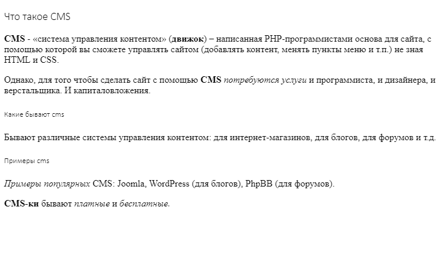
  </li>
  <li>
    <div style="display: flex; flex-direction: column">
        <div> Повторите страницу по данному по образцу</div>
        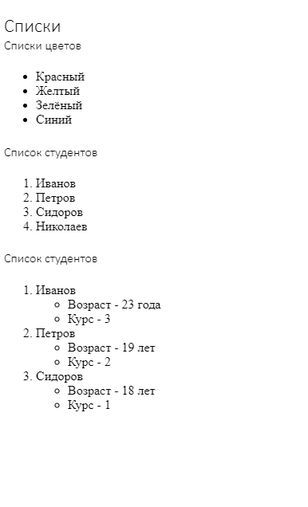
    </div>
  </li>
  <li>Повторите страницу по данному по образцу
    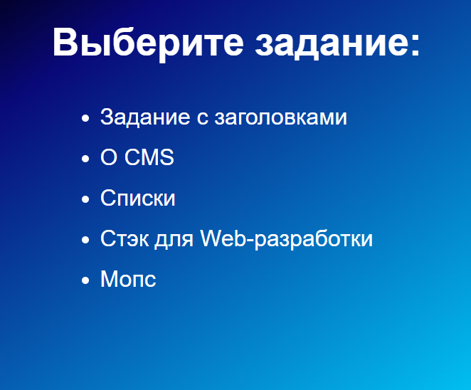
  </li>
  <li>
    <div style="display: flex; flex-direction: column">
        <div> Повторите страницу по данному по образцу</div>
        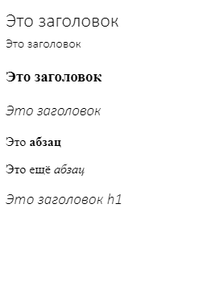
    </div>
  </li>
  <li><div>Повторите страницу по данному по образцу</div>
    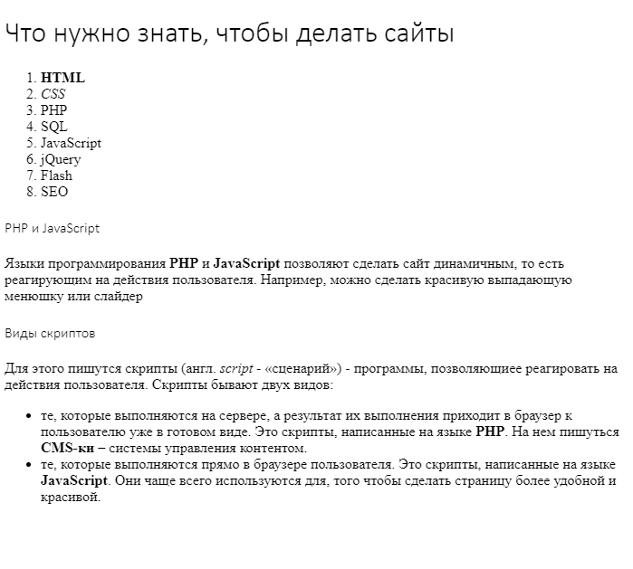
  </li>
  <li>
    <div style="display: flex; flex-direction: column">
        <div> Создать структуру HTML страницы с использованием заголовка, абзацев, списков и изображений.</div>
        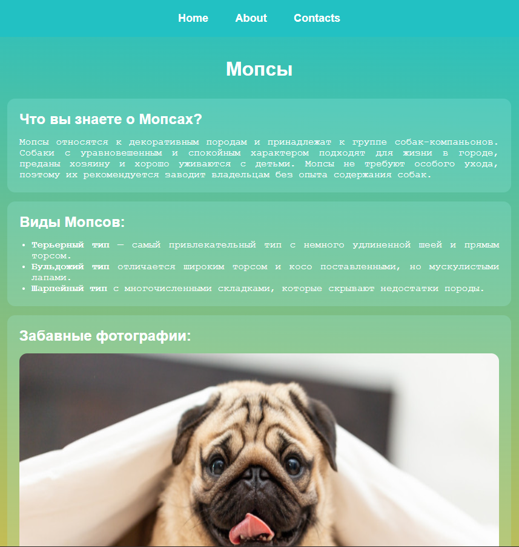
    </div>
  </li>
  <li>
    <div style="display: flex; flex-direction: column">
        <div> Вставить видео на страницу с помощью тега &lt;video&gt; и добавить управляющие элементы.</div>
        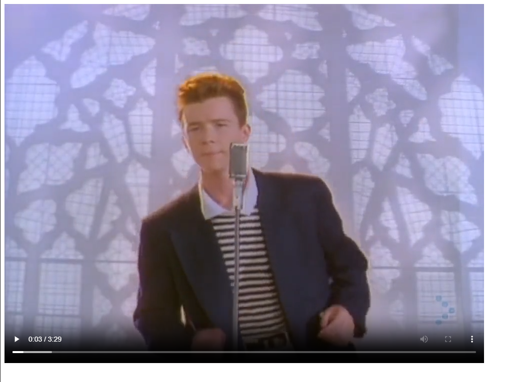
    </div>
  </li>
  <li>
    <div style="display: flex; flex-direction: column">
        <div> Создать форму обратной связи с полями для ввода имени, email и сообщения.</div>
        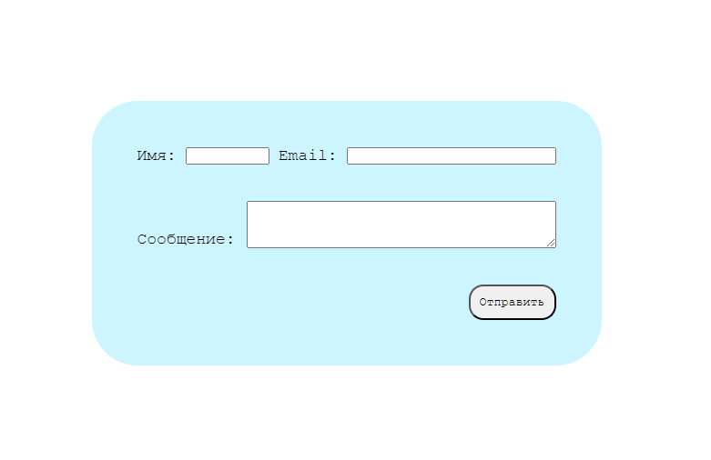
    </div>
  </li>
  <li>
    <div style="display: flex; flex-direction: column">
        <div> Разработать таблицу с данными о товарах (название, цена, описание) и стилизовать её с помощью CSS.</div>
        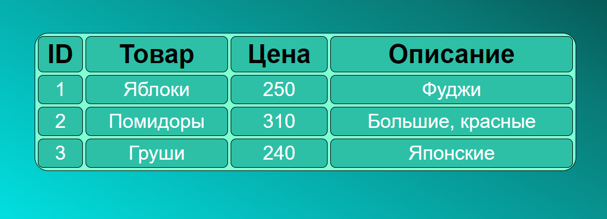
    </div>
  </li>
  <li>
    <div style="display: flex; flex-direction: column">
        <div> Добавить на страницу интерактивную карту с маркерами и информацией о местоположении.</div>
        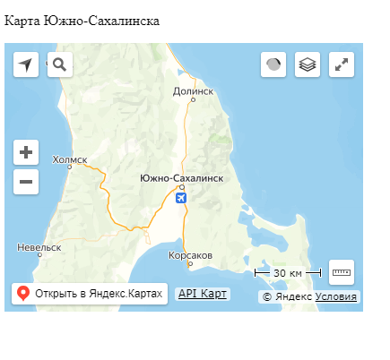
    </div>
  </li>
  <li>
    <div style="display: flex; flex-direction: column">
        <div> Реализовать выпадающее меню навигации с использованием HTML и CSS.</div>
        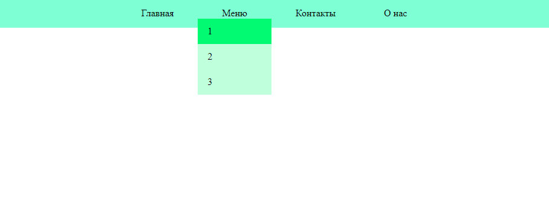
    </div>
  </li>
  <li>
    <div style="display: flex; flex-direction: column">
        <div> Вставить аудио-плеер на страницу для воспроизведения музыкального трека.</div>
        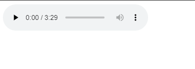
    </div>
  </li>
  <li>
    <div style="display: flex; flex-direction: column">
        <div> Создать галерею изображений с возможностью пролистывания и увеличения фотографий.</div>
        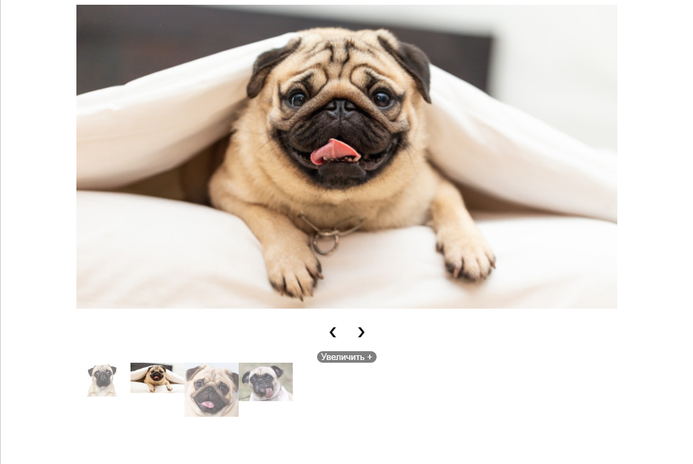
    </div>
  </li>
  <li>
    <div style="display: flex; flex-direction: column">
        <div> Разработать форму заказа товара с выбором количества и кнопкой отправки заказа.</div>
        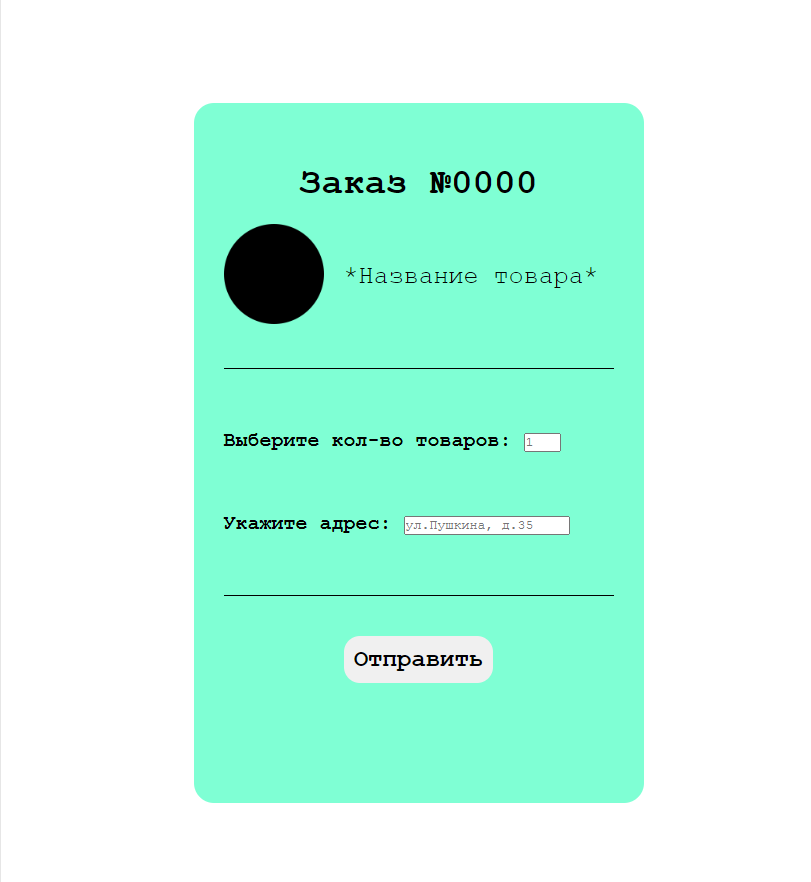
    </div>
  </li>
  <li>
    <div style="display: flex; flex-direction: column">
        <div> Использовать iframe для встраивания внешнего контента (например, карты Google или видео с YouTube).</div>
        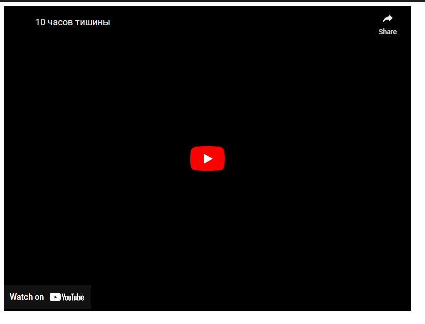
    </div>
  </li>
  <li>
    <div style="display: flex; flex-direction: column">
        <div> Добавить на страницу анимированный слайдер с переходами между изображениями.</div>
        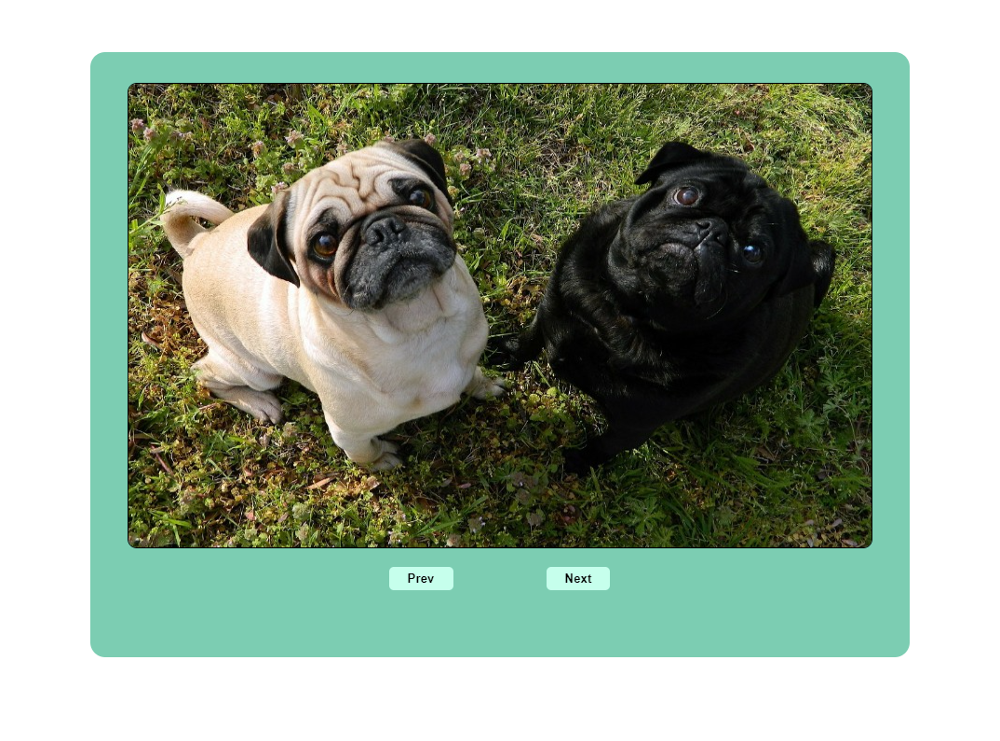
    </div>
  </li>
  <li>
    <div style="display: flex; flex-direction: column">
        <div> Реализовать функционал проверки вводимых данных в форме с помощью JavaScript.</div>
        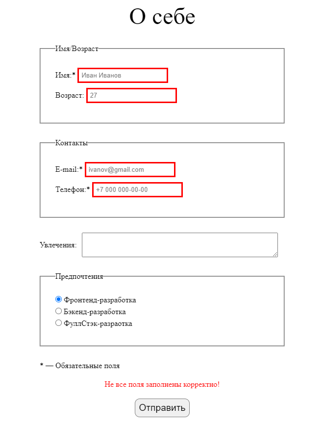
    </div>
  </li>
  <li>
    <div style="display: flex; flex-direction: column">
        <div> Создать анимированное меню бургер для мобильной версии сайта.</div>
        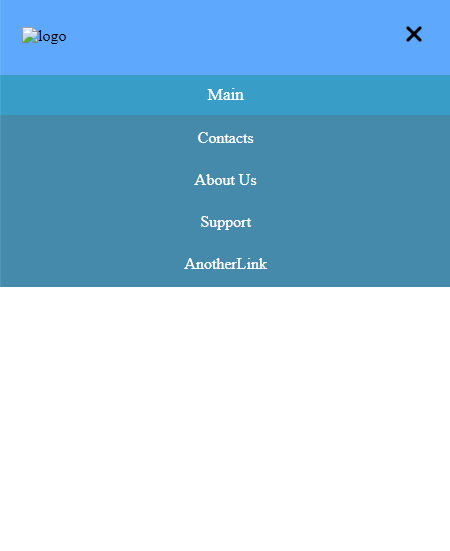
    </div>
  </li>
  <li>
    <div style="display: flex; flex-direction: column">
        <div> Использовать тег &lt;canvas&gt; для создания простой графики или анимации на странице.</div>
        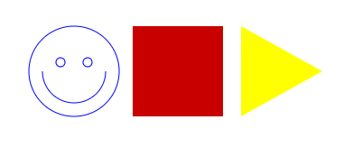
    </div>
  </li>
  <li>
    <div style="display: flex; flex-direction: column">
        <div> Добавить на страницу элементы социальных сетей с возможностью перехода по ссылкам.</div>
        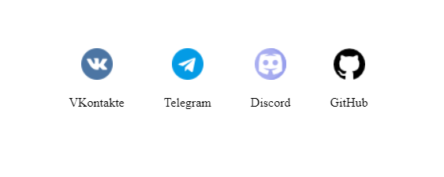
    </div>
  </li>
  <li>
    <div style="display: flex; flex-direction: column">
        <div> Разработать форму регистрации пользователей с проверкой пароля на соответствие требованиям.</div>
        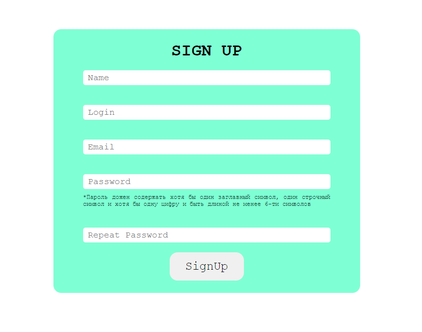
    </div>
  </li>
  <li>
    <div style="display: flex; flex-direction: column">
        <div> Создать табличное представление данных с возможностью сортировки и фильтрации по столбцам.</div>
        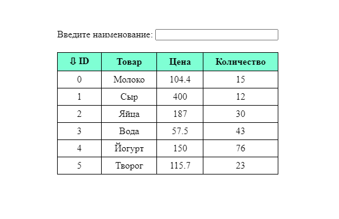
    </div>
  </li>
  <li>
    <div style="display: flex; flex-direction: column">
        <div> Использовать Web-шрифты для стилизации текста на странице.</div>
        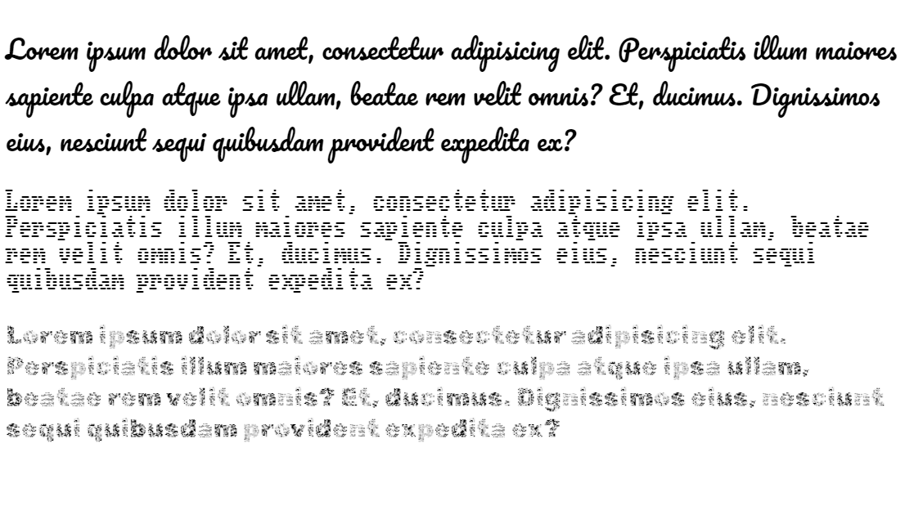
    </div>
  </li>
  <li>
    <div style="display: flex; flex-direction: column">
        <div> Реализовать функционал Drag and Drop для перетаскивания элементов на странице.</div>
        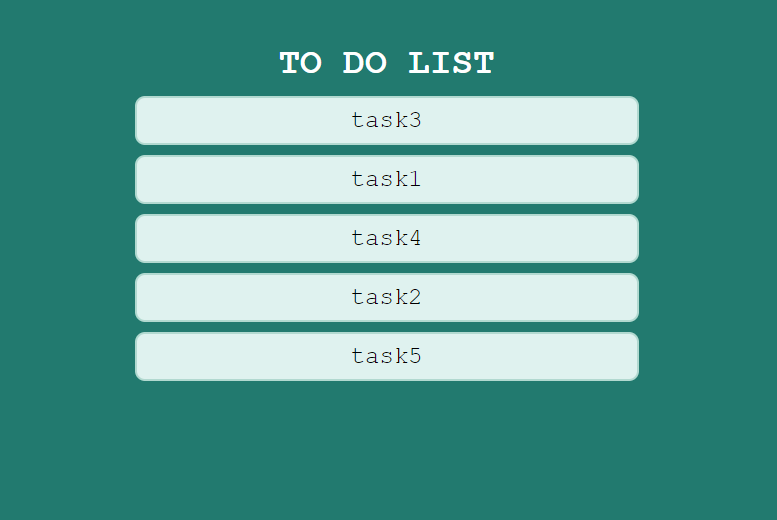
    </div>
  </li>
  <li>
    <div style="display: flex; flex-direction: column">
        <div> Создать адаптивную веб-страницу, которая корректно отображается на разных устройствах и разрешениях экрана.</div>
        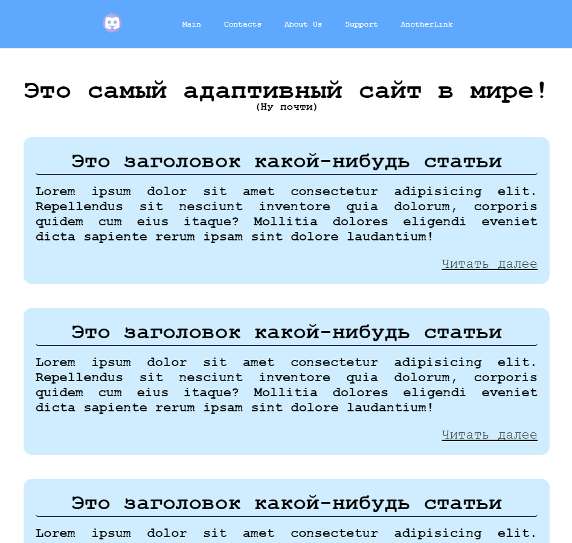
    </div>
  </li>
</ol>
<h1 align = "center">Вывод</h1>
<p align="justify">По итогу проделанной лабораторной работы я научился создавать самые распространённые компоненты web-страниц. Улучшил навыки работы с HTML, CSS и JS.</p>
